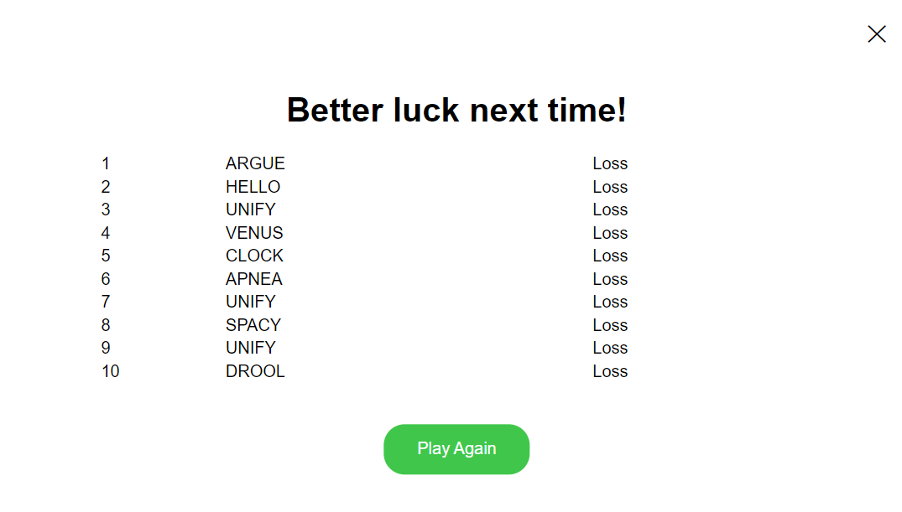

# Design Document

## Front-End Components
### Headers
The header of the game is positioned at the top of the screen and serves as an easily accessible menu for users. The game title is centered within the header, ensuring that it is easily identifiable without overshadowing the gameboard and playing experience. Within the header, users can also find two intuitively recognizable buttons with symbols that represent a button to access the help and instructions, and another to access the scoreboard. Please refer to [Header Mockup](/docs/assets/design_system/header.html) for the header mockup.  


### Gameboard
The gameboard in Wordle is a grid where users can input multiple guesses for a hidden word, each guess leading them closer to the hidden word. The 6x5 grid consists of 30 sleek and minimalist tiles, each allowing a user to type a letter. As hints to help the user guess the hidden word, the tiles change to either yellow, green, or grey based on whether their guessed letter is correct or not. Refer to [README.md](/README.md) for more details. The overall minimalist design of the game allows the user to focus on the guesses of the words themselves. Please refer to [Gameboard Mockup](/docs/assets/design_system/gameboard.html) for the gameboard mockup.  


### Instructions
The instructions for the Wordle game are designed to be accessible and informative, providing guidance to the user without disrupting the gameplay itself. It is accessible through the button in the headers featuring a question mark, ensuring users can easily find and access the instructions. The instructions themselves are concise and presented to be easily digestible for a new user. It is also easily accessible during any step of the game, which allows players to refer to the instructions as much as they may need. Please refer to [Instructions Mockup](/docs/assets/design_system/instructions.html) for the instructions lightbox mockup.  


### Scoreboard
The button to access the scoreboard in the game is indicated by a button with the bar graph symbol and located on the right-end of the header, positioned carefully to avoid disrupting a user's gameplay experience. The scoreboard provides players with real-time tracking of their progress, displaying key information such as a short message, their number of wins, and their respective winning word guesses. In addition, the scoreboard includes a button 'Play Again' to allow users to restart the game and play another run. The scoreboard will continue to track the scores of all games while the user is connected to the game. By integrating a scoreboard and an option to replay the game within the game, users can become more invested in the gameplay and their progress. Please refer to [Scoreboard Mockup](/docs/assets/design_system/scoreboard.html) for the scoreboard mockup.  



### Footers
The footer of the game is positioned at the bottom of the screen and simply indicates copyright information. The information is centred and kept minimal to avoid detracting from the overall game experience, but is easy to read. Please refer to [Footer Mockup](/docs/assets/design_system/footer.html) for the footer mockup.  


### Fonts and Sizes
The primary font for the game is Arial, a timeless sans-serif font designed for readability and accessibility. It is a standard font and widely used amongst websites - modern looking and easy to read under any background. It is also a web-safe font that is typically pre-installed and readily available on the majority of operating systems, eliminating the need for installation and ensuring quick load times.

If Arial is not available, the font switches to the secondary font, Helvetica, which inspired Arial's design. It is just as readable as Arial, with an added touch of elegance and sharper lines. Finally, in the rare instances that both Arial and Helvetica are not available, the website will automatically default to any sans-serif font that the computer has installed, making sure to provide an accessible and readable alternative. 

Font sizes are chosen to ensure clarity and structure. Headers, including the title, use a 16px font to ensure prominence and catch a reader's attention. The letters within the tiles are the same size as the headers, but appear bigger because of the gameboard's design. This assures that the title does not distract the user. This font size ensures overall readability and comfort for the user experience.

### Colours
The colour palette is carefully curated to provide the user with an enhanced user experience, using high-contrasting colours to emphasize readability and accessibility. All the text in the game is black (#000000), and the main game area features a white background (#FFFFFF). Wordle also uses yellow, green, and grey in their respective tiles to indicate the status of each letter in each guess, based on whether or not the letter is a letter in the word and if it's in the correct position or not. These colours provide immediate visual feedback of the guesses, making the game system easy to understand without needing to read instructions. Refer to [README.md](/README.md) for more details on how the colours correlate to the guesses. Overall, these colour aspects provide a modern, sleek, and visually appealing interface that is both user-friendly and eye-catching.

## Back-End Components
All of these components can be found in the [script.js](/script.js) file.

### The buildGame() Function
At the beginning of each game, the gameboard needs to be cleared, especially if the user had just played a round. To make the process easier, the buildGame() function is used to re-generate all of the front-end components of the gameboard, so that everything is reset to its original state quickly and in a simple manner.  
```javascript
function buildGame() {
    var oldTiles = document.getElementsByClassName("tiles")[0];
    var tiles = document.createElement("table");
    tiles.classList.add("tiles");

    for (let i = 0; i < 6; i++) {
        var row = document.createElement("tr");

        for (let j = 0; j < 5; j++) {
            var cell = document.createElement("td");
            var tile = document.createElement("div");
            var tileFront = document.createElement("div");
            var tileBack = document.createElement("div");
            var inputLetter = document.createElement("h1");
            var displayLetter = document.createElement("h1");
    
            tile.classList.add("tile");
            tileFront.classList.add("tile-front");
            tileBack.classList.add("tile-back");
            inputLetter.classList.add("input-letter");
            displayLetter.classList.add("input-letter");
    
            tileFront.appendChild(inputLetter);
            tileBack.appendChild(displayLetter);
            tile.appendChild(tileFront);
            tile.appendChild(tileBack);
    
            cell.appendChild(tile);
            row.appendChild(cell);
        }
        tiles.appendChild(row);
    }
    if (oldTiles) {
        document.body.replaceChild(tiles, oldTiles);
    }
    else {
        document.body.insertBefore(tiles, document.getElementsByClassName("footer")[0]);
    }
}
```

### The Keyboard Input
This game relies on the user entering letters using their keyboard. To prevent the user from entering any unauthorized characters, a keydown event is used to restrict the user's input to letters, the Backspace, and the Space key. Every time a user presses on a key, the keydown event is triggered and it checks whether the key was a letter key (lowercase or capital), the Backspace, or the Enter key.  
If a letter key is entered, it should then appear on the tile as a visual confirmation of the key being pressed and move to the next empty tile. If the user tries to enter a key again, it will check to see if the guess already has 5 letters. If it already has 5 letters, it will stop capturing the key that the user is entering. If the Backspace is pressed, it should erase the letter that was entered and return to the previous tile. If the guess has 0 letters and the Backspace is pressed, no action is triggered. If the Enter key is pressed, the user must be able to submit their guess only if the guess has 5 letters. If it has any less, pressing Enter will not cause any action. Once a guess is submitted, the user cannot use the Backspace key to modify a previous guess. Guesses are locked once they are submitted. Once the user uses up all 6 attempts, the game is over and the keydown presses will no longer trigger any action.

### Game Object
Each round of the game runs on a Game object. The object is responsible for storing the number of attempts the user makes (from 0 to 7 where 7 means that the user did not win), the word that needs to be guessed (correctWord), the inventory of words that the object randomly picks from to set correctWord, the guesses that the user submits, and returning the results of a guess.
**NOTE:** Checking the validity of a word is done in the [Session.php](/models/Session.php) file through the use of the Datamuse API.

#### Starting A New Game
The Game object is responsible for keeping track of every round and game. If the user stars the game for the first time, a new session is opened and a Game object is created. Once a user hits "Play Again", a new Game object is created and the correctWord is initialized. correctWord is randomly assigned based on what 5-letter words are in the wordInventory instance variable of the object. This is done in the PHP header of [index.php](/index.php).

```php
require "models/Game.php";
session_start();

use Wordle\Game;

$_SESSION["games"] = []; //stores a list of games that have been played
$_SESSION["game"] = new Game();
```

#### Checking A Guess
Once a user submits a guess, the guess is sent to the PHP server along with the action "submitGuess". The submitGuess action will then check the word. It adds the guess to the array of guesses of that round, checks to see if the guess is a valid word using the isWord() function, and then it returns either a boolean or 3 arrays. If the word perfectly matches correctWord, the guess is considered a match and it sends back True in the response to signal the end of the game. Otherwise, the response stores 3 arrays: correctPositions, correctLetters, and incorrectLetters:
* correctPositions is an array of indices that indicate which letters are correct (letters are in correctWord and in the correct position). These letters will be indicated by a green tile in the front-end. 
* correctLetters is an array of indices that indicate which letters are in correctWord, but in the wrong position. These letters are indicated by a yellow tile in the front-end.
* incorrectLetters is an array of indices that indicate which letters are not in correctWord at all. These letters are indicated by a gray tile in the front-end.  

```php
if (isset($_POST["action"]) && $_POST["action"] == "submitGuess") {
    $guess = join("", $_SESSION["guess"]);
    $game = $_SESSION["game"];

    if (strlen($guess) != 5) {
        $_SESSION["result"] = "Guess must be 5 characters.";
    }
    else if (!isWord($guess)) {
        $_SESSION["result"] = "Not a word";
    }
    else {
        $result = $game->checkWord($guess);
        $_SESSION["attempts"]++;
        
        if ($result === true) {
            $_SESSION["gameOver"] = true;
            $_SESSION["game"]->setAttempts($_SESSION["attempts"] - 1); //set the score for this round
            $_SESSION["games"][] = $_SESSION["game"]; //push current game to the list of games
        }
        else {
            $correctPositions = $result[0];
            $correctLetters = $result[1];
            $incorrectLetters = $result[2];

            if ($_SESSION["attempts"] > 6) {
                $_SESSION["gameOver"] = true;
                $_SESSION["game"]->setAttempts($_SESSION["attempts"]); //set the score for this round
                $_SESSION["games"][] = $_SESSION["game"]; //push current game to the list of games
                $_SESSION["correctWord"] = $game->getCorrectWord();
            }

            $_SESSION["letter"] = 0; //reset for the next guess
            $_SESSION["guess"] = []; //reset for the next guess
        }

        $_SESSION["result"] = $result;
    }

    $response["games"] = displayGames();
    $response["attempts"] = $_SESSION["attempts"];
    $response["gameOver"] = $_SESSION["gameOver"];
    $response["correctWord"] = $_SESSION["correctWord"];
    $response["result"] = $_SESSION["result"];
}
```
#### Checking The Validity Of A Guess
The isWord() function uses the Datamuse API to check whether the word exists in the English dictionary. The user's guess is passed in as an input and the function checks if the retrieved JSON file is empty or if the guess is in the JSON file. The Datamuse API will return an empty JSON file if there is no word or no similar word to the input. This means that the guess is invalid. Sometimes, the API may return words that it infers is what the word is supposed to be spelled, so the function will then check if the input is exactly in the JSON file. If not, the guess is considered invalid. If a guess is invalid, the front-end will deny the guess and prompt the user to enter their guess again.  

```php
//Datamuse API is used to check whether the input is an actual word.
//The API can be found at https://www.datamuse.com/api/
function isWord($guess) {
    $url = "https://api.datamuse.com/words?sp=" . $guess;

    $curl = curl_init();
    curl_setopt($curl, CURLOPT_URL, $url);
    curl_setopt($curl, CURLOPT_RETURNTRANSFER, true);

    $words = curl_exec($curl);

    if (!curl_errno($curl) && $words) { 
        curl_close($curl);
        $words = json_decode($words);

        $matches = array_filter($words, function($item) use ($guess) {
            return $item->word == strtolower($guess);
        });

        if ($matches) { //if guess is found in the list of words, then it is valid
            return true;
        }
        else {
            return false;
        }
    }
    else { //false on failure
        //if there's an API failure, simply accept the guess
        //the player may waste turns if they have a spelling mistake but it will avoid crashes if the API does not work
        curl_close($curl);
        return true;
    }
}
```


#### Checking For Letters That Are In The Correct Position
checkWord() calls the checkPositions() function to return the correctPositions array. The function essentially iterates through every letter in both the user's guess and the correctWord, checking if there are any letters that match at the same index. If so, it is appended to the correctPositions array. Once it is done, it returns the array. It is possible for the array to be empty if there are no letters that are correct.  

```php
private function checkPositions($inputArray, $correctArray) {
    $correctPositions = [];

    for ($i = 0; $i < self::WORD_LENGTH; $i++) {
        if ($inputArray[$i] == $correctArray[$i]) {
            $correctPositions[] = $i;
        }
    }

    return $correctPositions;
}
```

#### Checking For Letters That Are In The Word But Wrong Position
After calling checkPositions(), checkWord() calls the checkLetters() function to return the correctLetters and incorrectLetters arrays. The checkLetters() function starts by going through the correctWord and the user's guess and marking all the letters that we know are already correct as "null". This way, we will not accidentally append the same letters in the correctPositions array into the correctLetters array.  
It then checks which letters are in the word by checking whether each letter is in correctWord. If it is in correctWord, we mark the letter in correctWord as null and append this index to the correctLetters array. This is due to special cases where the same letter can appear multiple times. For example, "robot" has 2 O's. If a user enters a word with 3 O's, the first 2 O's are considered a correct letter and the last O is considered incorrect. Therefore, we must mark them as null so that we do not accidentally double count the same letter. Once it has iterated through and checked every single letter in the user's guess, it returns the correctLetters and incorrectLetters array.  
```php
private function checkLetters($inputArray, $correctArray, $correctPositions) {
    $correctLetters = [];
    $incorrectLetters = [];
    
    //set all the letters we know are correct to null
    for ($i = 0; $i < count($correctPositions); $i++) {
        $correctArray[$correctPositions[$i]] = null;
        $inputArray[$correctPositions[$i]] = null;
    }

    //check if the letter is in the list. if it is, set the letter to null in current so that we don't double count.
    for ($i = 0; $i < count($inputArray); $i++) {
        $j = 0;
        while ($j < count($correctArray)) {
            //if no non-null match and about to reach end of array, then this letter from inputArray is nowhere to be found in currentArray
            //therefore, it is incorrect
            if ($j == count($correctArray) - 1 && $inputArray[$i] != $correctArray[$j] && $inputArray[$i] != null) {
                $incorrectLetters[] = $i;
            }

            //if there is a non-null match, then this letter is in the word, but in the wrong position
            else if ($inputArray[$i] == $correctArray[$j] && $inputArray[$i] != null) {
                $correctLetters[] = $i;
                $correctArray[$j] = null;
                break;
            }
            $j++;
        }
    }

    return [$correctLetters, $incorrectLetters];
}
```

#### Checking For Letters That Are Not In The Word
Within the checkLetters() function, as it is checking which letters are in the word, it is also checking which letters are not in the word. If the loop reaches the end of correctWord and cannot find a non-null match, the letter is considered incorrect and is then appended to the incorrectLetters list. The incorrectLetters array is returned alongside the correctLetters array.  
```php
private function checkLetters($inputArray, $correctArray, $correctPositions) {
    $correctLetters = [];
    $incorrectLetters = [];
    
    //set all the letters we know are correct to null
    for ($i = 0; $i < count($correctPositions); $i++) {
        $correctArray[$correctPositions[$i]] = null;
        $inputArray[$correctPositions[$i]] = null;
    }

    //check if the letter is in the list. if it is, set the letter to null in current so that we don't double count.
    for ($i = 0; $i < count($inputArray); $i++) {
        $j = 0;
        while ($j < count($correctArray)) {
            //if no non-null match and about to reach end of array, then this letter from inputArray is nowhere to be found in currentArray
            //therefore, it is incorrect
            if ($j == count($correctArray) - 1 && $inputArray[$i] != $correctArray[$j] && $inputArray[$i] != null) {
                $incorrectLetters[] = $i;
            }

            //if there is a non-null match, then this letter is in the word, but in the wrong position
            else if ($inputArray[$i] == $correctArray[$j] && $inputArray[$i] != null) {
                $correctLetters[] = $i;
                $correctArray[$j] = null;
                break;
            }
            $j++;
        }
    }

    return [$correctLetters, $incorrectLetters];
}
```

### Calculating Results
Once the user presses the Enter key, the guess is submitted to the submitGuess block in [Session.php](/models/Session.php) to return the results in the response. If the result is True, then the guess is a perfect match. The game then ends. Otherwise, the script will colour the backgrounds of the tiles using DOM to be green if the letter in the guess is in the correct position, yellow if the letter is in the word but in the wrong position, and gray if the letter is incorrect. Once the round ends, the current Game object is appended to an array, games, which is used to track the user's past games.  

### Tracking The Scores
Since each round is a separate Game object, the script is able to store the number of attempts and the correct word in the array, games. It then uses the displayAllGames() function to build a table that reads the number of attempts that were made in each round and the correct word and displays it as statistics to the user. The user can view their statistics either by clicking on bar graph symbol in the header or it is automatically displayed to the user at the end of each game.  
```php
function displayAllGames(games) {
    var popup = document.getElementsByClassName("popup")[0];
    var gamesTable = document.createElement("table");
    gamesTable.classList.add("games-table");
    var gamesLen = 10;

    games.sort(function(a, b){return a[0] - b[0]}); //sort by score (lowest score is first)

    if (games.length < 10) { //only display the top 10 scores
        gamesLen = games.length;
    }

    games = games.slice(0, gamesLen); //take the top 10 scores (if less than 10, take all of them)

    for (let i = 0; i < gamesLen; i++) {
        var row = document.createElement("tr");

        var rowNum = document.createElement("td");
        rowNum.innerHTML = i + 1;

        var correctWord = document.createElement("td");
        correctWord.innerHTML = games[i][1];

        var result = document.createElement("td");
        if (games[i][0] == 7) {
            result.innerHTML = "Loss";
        }
        else {
            result.innerHTML = "Won in " + games[i][0] + " guesses";
        }

        row.appendChild(rowNum);
        row.appendChild(correctWord);
        row.appendChild(result);
        gamesTable.appendChild(row);
        
        popup.replaceChild(gamesTable, popup.children[2]); //replace the original table with the new table
    }
}
```